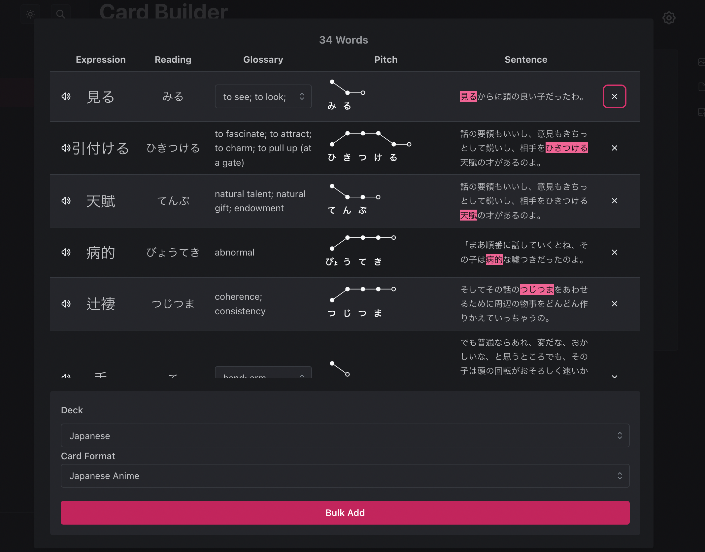

# Welcome to AnkiDojo

AnkiDojo is an easy-to-use and fully-featured Japanese toolkit for Anki.

## Features

- Import cards from Kindle, handwritten notes, or txt file.
- Adds pitch accent, definition, and audio.
- Mini games with your Japanese cards. Difficulty based on the ease level in your Anki deck.

## Open source and simple API
- Simple and straightforward API to leverage Anki Dojo's mapping.
- Feel free to submit your own apps for Anki Dojo!