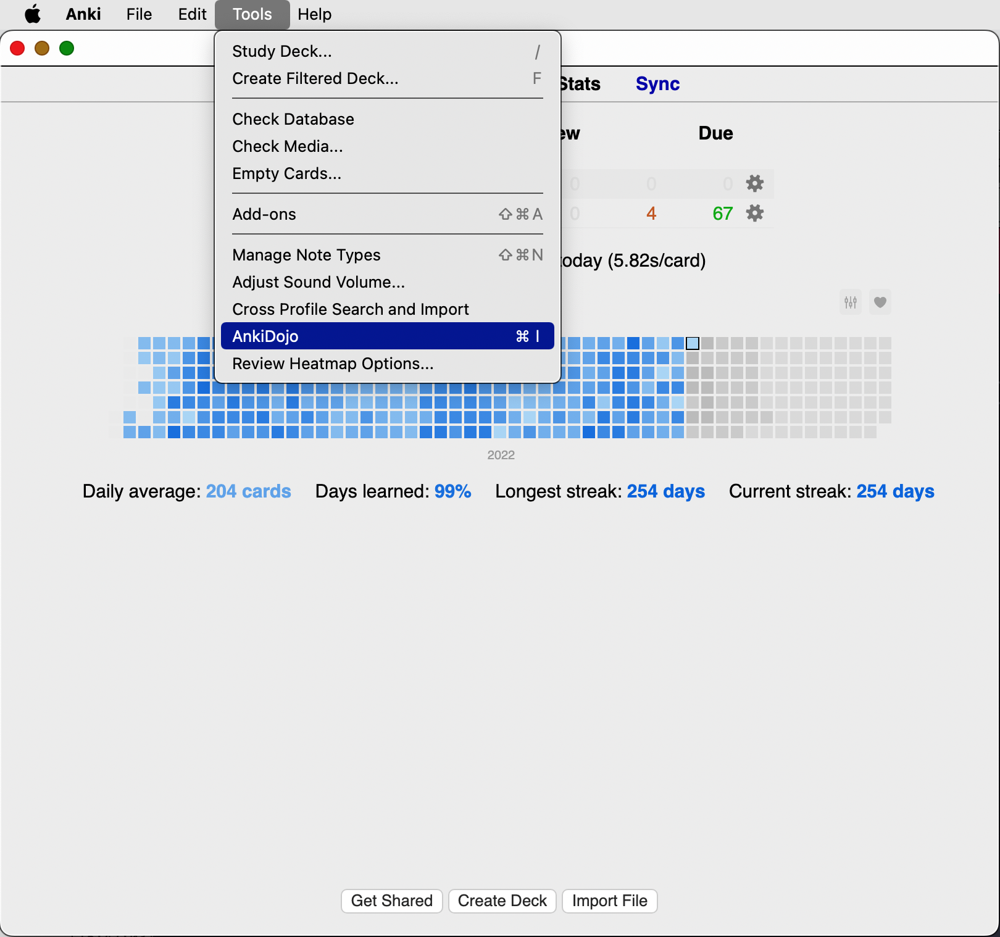

# Getting Started

## Installation

You can find [AnkiDojo on Anki web](https://ankiweb.net/shared/info/433778282). 

In Anki, select *Tools > Add-ons > Get Add-ons*, and paste the code: *433778282*

You will also need to install [Mecab Unidic Addon](https://github.com/ianki/MecabUnidic/releases/download/v3.1.0/MecabUnidic3.1.0.ankiaddon) to unlock all of AnkiDojo's functionality. Double click on the addon file with Anki active, and restart Anki once installation is complete. 

## Launching AnkiDojo

After installation, restart Anki and launch AnkiDojo from Tools > AnkiDojo. 

Shortcut *ctrl+I* or *command+I* can be used as well.

!!! information
    Shortcut *ctrl+I* or *command+I* can be used as well. If nothing happens, Anki may not have permission to open links. In that case, visit [http://localhost:5008/apps](http://localhost:5008/apps)

## Configuring Anki

Navigate to **Settings** and select **Add Card Format**.

Select a *model*. 

For each field, select the corresponding value. If nothing matches, you can keep it empty.

Click **Add Format** to confirm your card type.

Finally, to make adding cards more convenient, select a primary deck.

Now you're good to go to use AnkiDojo. You can know about more settings by using the search bar here.